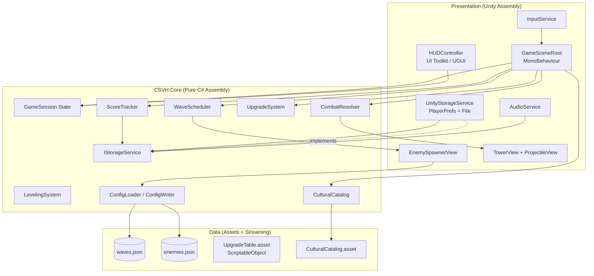
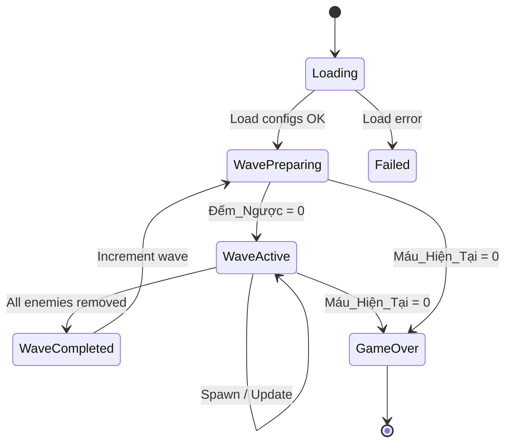
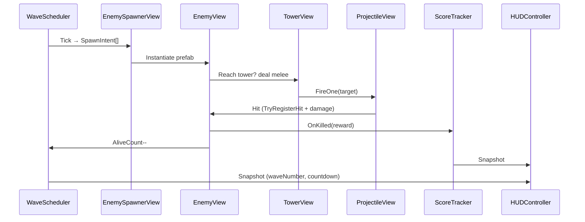

# Design Document

> Tower Defense Việt Nam (CSVH) - Tài liệu Thiết kế

## Overview

Tower Defense Việt Nam (CSVH) là một game thủ thành 2D với góc nhìn isometric/2.5D, được phát triển trên **Unity 6 URP 2D** (project hiện tại tại `d:\Unity\csvh`). Trận đấu xoay quanh một Thành cố định ở góc Đông Nam, chống lại các đợt Quái xuất phát từ phía Tây/Tây Bắc theo cấu hình JSON có thể nóng-tải. Số Đợt tăng vô hạn, cho phép người chơi cạnh tranh kỷ lục cá nhân.

Thiết kế tách rõ hai tầng:

1. **Tầng Core (pure C#)**: chứa toàn bộ logic không phụ thuộc Unity (cấu hình JSON, EXP/Level, tính sát thương, hàng đợi spawn, scoring, upgrade arithmetic). Tầng này biên dịch trong assembly `CSVH.Core` và là mục tiêu chính của Property-Based Testing.
2. **Tầng Presentation (Unity)**: MonoBehaviour, ScriptableObject, Prefab, URP rendering, UI Toolkit/UGUI HUD, input và audio. Tầng này tham chiếu Core và chỉ giữ trạng thái runtime của scene.

Quyết định kiến trúc này giúp:
- Property-Based Testing chạy trên .NET console (không cần Unity Editor) → nhanh và rẻ.
- Logic ổn định, dễ tái sử dụng cho tooling (level editor, balance dashboard).
- Tránh vướng `MonoBehaviour` lifecycle trong các thuộc tính bất biến (round-trip JSON, monotonic level, …).

### Nguồn tham khảo

- Unity Manual - 2D URP Renderer Setup ([docs.unity3d.com/Packages/com.unity.render-pipelines.universal](https://docs.unity3d.com/Packages/com.unity.render-pipelines.universal/))
- Unity Manual - ScriptableObject ([docs.unity3d.com](https://docs.unity3d.com/Manual/class-ScriptableObject.html))
- FsCheck - Property-Based Testing for .NET ([fscheck.github.io/FsCheck](https://fscheck.github.io/FsCheck/))
- Unity Test Framework + NUnit ([docs.unity3d.com/Packages/com.unity.test-framework](https://docs.unity3d.com/Packages/com.unity.test-framework/))
- Newtonsoft Json for Unity (`com.unity.nuget.newtonsoft-json`) - chính thức Unity hỗ trợ.

## Architecture

### Tầng tổ chức



### Vòng đời một Đợt (Wave Lifecycle)



### Khung thư mục dự kiến

```
Assets/
  CSVH/
    Core/                        // asmdef: CSVH.Core (no Unity refs except json)
      Config/
        EnemyConfig.cs
        WaveConfig.cs
        ConfigLoader.cs
        ConfigWriter.cs
      Combat/
        CombatResolver.cs
        ProjectileLogic.cs
        DamagePipeline.cs
      Wave/
        WaveScheduler.cs
        SpawnQueue.cs
      Progression/
        LevelingSystem.cs
        UpgradeSystem.cs
        ScoreTracker.cs
      Storage/
        IStorageService.cs
        StorageKeys.cs
      Culture/
        CulturalCatalog.cs
      Common/
        FieldGeometry.cs
        Result.cs
    Game/                        // asmdef: CSVH.Game (Unity refs)
      Scenes/
      Prefabs/
      Scripts/
        Bootstrap/GameSceneRoot.cs
        Spawning/EnemySpawnerView.cs
        Tower/TowerView.cs
        Tower/ProjectileView.cs
        UI/HUDController.cs
        UI/UpgradeIconView.cs
        Storage/UnityStorageService.cs
        Audio/AudioService.cs
      Data/
        UpgradeTable.asset
        CulturalCatalog.asset
    StreamingAssets/
      waves.json
      enemies.json
    Tests/
      EditMode/                  // asmdef: CSVH.Tests.Edit (FsCheck.NUnit)
      PlayMode/                  // asmdef: CSVH.Tests.Play
```

### Quyết định công nghệ

| Quyết định | Lý do |
|---|---|
| Tách `CSVH.Core` thành assembly không phụ thuộc Unity | Cho phép FsCheck chạy nhanh trên CI; logic không lệ thuộc lifecycle Editor. |
| Dùng Newtonsoft.Json (`com.unity.nuget.newtonsoft-json`) | Hỗ trợ chuẩn hóa whitespace, error message line/col, cú pháp pretty-print, được Unity khuyến nghị cho package modern. |
| ScriptableObject cho `UpgradeTable` và `CulturalCatalog` | Designer-friendly, tránh thay đổi mã khi tinh chỉnh; hot-reload trong Editor. |
| JSON cho `waves.json`/`enemies.json` (StreamingAssets) | Đáp ứng Requirement 10: nạp/xuất runtime, chỉnh ngoài build. |
| URP 2D Renderer (đã thiết lập trong `Assets/Settings/Renderer2D.asset`) | Hỗ trợ Light2D, isometric sorting, hiệu ứng đẹp cho hoa văn Đông Sơn. |
| UI Toolkit cho HUD (UXML/USS) | Anchoring tự động, dễ giữ vùng cố định khi đổi độ phân giải; tách style khỏi logic. |
| FsCheck (NUnit integration) | PBT chuẩn cho .NET; cộng đồng lớn, shrink tốt cho config phức tạp. |
| PlayerPrefs cho âm lượng + JSON file cho Kỷ_Lục | Âm lượng đơn giản; Kỷ_Lục cần fallback mặc định khi file hỏng (Req 12.4). |

## Components and Interfaces

### Core - Cấu hình và geometry

```csharp
namespace CSVH.Core.Common;

public readonly record struct FieldPoint(float X, float Y)
{
    public bool IsValidSpawnPoint() => X <= 0f || Y >= 0f;
    public bool IsValidTowerPoint() => X > 0f && Y < 0f;
}

public sealed record FieldGeometry(float HalfWidth, float HalfHeight, FieldPoint TowerPosition, float TowerCollisionRadius);
```

### Core - Config Loader / Writer

```csharp
namespace CSVH.Core.Config;

public sealed record EnemyConfig(
    string Id,
    string LocalizedName,
    float MaxHp,
    float Speed,
    float MeleeDamage,
    float Resistance,
    int GoldReward,
    int ExpReward,
    int ScoreReward
);

public sealed record SpawnEntry(string EnemyId, int Count, float SpawnIntervalSeconds);

public sealed record WaveConfig(
    int WaveNumber,
    IReadOnlyList<SpawnEntry> Spawns,
    IReadOnlyList<FieldPoint> SpawnGates,
    float PreparationSeconds
);

public sealed record ConfigBundle(
    IReadOnlyList<EnemyConfig> Enemies,
    IReadOnlyList<WaveConfig> Waves
);

public interface IConfigLoader
{
    Result<ConfigBundle, ConfigError> Load(string wavesJson, string enemiesJson);
}

public interface IConfigWriter
{
    string Write(ConfigBundle bundle); // pretty-print, UTF-8 ổn định
}

public sealed record ConfigError(string FieldPath, int Line, int Column, string Message);
```

`Load` thực hiện:
1. Parse JSON.
2. Validate lược đồ + invariants (`Speed > 0`, `MaxHp > 0`, `BaseDamage ≥ 0`, `RequiredExp > 0`, mọi `SpawnGate` thỏa `X ≤ 0 ∨ Y ≥ 0`, …).
3. Trả `Result.Ok(ConfigBundle)` hoặc `Result.Err(ConfigError)` với line/col.

### Core - Wave Scheduler

```csharp
namespace CSVH.Core.Wave;

public sealed class WaveScheduler
{
    private int _currentWave;          // bắt đầu = 1
    private float _countdown;
    private SpawnQueue _spawnQueue;    // FIFO các (EnemyId, gate)
    private readonly Func<float> _now; // injectable thời gian

    public WaveState State { get; private set; }
    public int CurrentWave => _currentWave;
    public bool IsBossWave => _currentWave % 5 == 0;

    public IReadOnlyList<SpawnIntent> Tick(float deltaSeconds, int aliveEnemies, int spawnCap);
    public void OnWaveCleared();      // tất cả Quái removed
    public void OnGameOver();         // dừng spawn
}
```

`SpawnIntent` chứa `EnemyConfig`, `FieldPoint Gate` để view layer hiện thực hóa Prefab. `Tick` tôn trọng `spawnCap = 200` (Requirement 13.4): nếu tổng (alive + về-spawn) > 200, các SpawnIntent dôi giữ trong hàng đợi.

### Core - Combat Resolver

```csharp
namespace CSVH.Core.Combat;

public readonly record struct DamageInputs(float BaseDamage, float AttackMultiplier, float TargetResistance);

public static class CombatResolver
{
    public static float ProjectileDamage(DamageInputs i)
        => MathF.Max(0f, i.BaseDamage * i.AttackMultiplier - i.TargetResistance);

    public static float MeleeDamageOnTower(float meleeDamage, float armor)
        => MathF.Max(0f, meleeDamage - armor);

    public static int ClampHp(int newValue, int max) => Math.Clamp(newValue, 0, max);
}
```

### Core - Projectile Logic (pure)

```csharp
public sealed class ProjectileLogic
{
    private readonly HashSet<int> _hitTargetIds = new(); // mỗi Quái nhận sát thương từ đạn này tối đa 1 lần
    public bool TryRegisterHit(int enemyId) => _hitTargetIds.Add(enemyId);
    public bool IsOutOfField(FieldPoint p, FieldGeometry g) =>
        MathF.Abs(p.X) > g.HalfWidth || MathF.Abs(p.Y) > g.HalfHeight;
}
```

### Core - Leveling System

```csharp
public sealed class LevelingSystem
{
    public int Level { get; private set; } = 1;
    public int CurrentExp { get; private set; }
    public int RequiredExp { get; private set; }
    private readonly float _scale;            // ≥ 1.0
    private readonly int _baseRequired;       // > 0

    public LevelingSystem(int baseRequired, float scale) { /* validate */ }
    public LevelUpResult AddExp(int amount);  // amount ≥ 0
}
```

`AddExp` thực hiện vòng lặp: `while (CurrentExp ≥ RequiredExp) { CurrentExp -= RequiredExp; Level++; RequiredExp = (int)Ceiling(RequiredExp * _scale); }`. Bất biến sau mỗi lần gọi: `0 ≤ CurrentExp < RequiredExp` và `Level` không bao giờ giảm.

### Core - Upgrade System

```csharp
public sealed class UpgradeSystem
{
    public int ArmorLevel { get; private set; }
    public int AttackLevel { get; private set; }
    public int SpecialLevel { get; private set; }
    public int Gold { get; private set; }

    public UpgradeOutcome TryBuy(UpgradeTrack track, IUpgradeCostTable costs);
    public float CurrentArmor(IUpgradeCostTable costs) =>
        costs.BaseArmor + ArmorLevel * costs.ArmorStep;
    public float CurrentAttackMultiplier(IUpgradeCostTable costs) =>
        1f + AttackLevel * costs.AttackStep;
}

public enum UpgradeTrack { Armor, Attack, Special }
public enum UpgradeOutcome { Bought, NotEnoughGold }
```

### Core - Score Tracker

```csharp
public sealed class ScoreTracker
{
    public long SessionScore { get; private set; }
    public long HighScore { get; private set; }
    public void AddEnemyKill(int reward);
    public void AddWaveCompletion(int waveNumber, int waveBonusBase);
    public bool TryFinalize(IStorageService storage); // returns true nếu lập kỷ lục
    public void LoadHighScore(IStorageService storage);
}
```

### Core - Storage

```csharp
public interface IStorageService
{
    long ReadHighScore();
    void WriteHighScore(long value);

    float ReadVolume(VolumeChannel channel); // [0,1], default 1
    void WriteVolume(VolumeChannel channel, float value);
}

public enum VolumeChannel { Music, Sfx }
```

### Core - Cultural Catalog

```csharp
public sealed record CulturalCatalog(
    IReadOnlyList<string> EnemyNames,    // ≥ 5
    IReadOnlyList<string> SpecialNames,  // ≥ 3
    IReadOnlyList<string> ProjectileNames
)
{
    public bool ContainsEnemy(string id) => EnemyNames.Contains(id);
    public bool ContainsSpecial(string id) => SpecialNames.Contains(id);
}
```

### Unity Layer

| Component | Trách nhiệm |
|---|---|
| `GameSceneRoot` (MonoBehaviour) | Bootstrap: load config, khởi tạo `WaveScheduler`, `LevelingSystem`, `UpgradeSystem`, đăng ký HUD. Tick logic mỗi frame và phát event sang view. |
| `EnemySpawnerView` | Nhận `SpawnIntent`, instantiate enemy prefab tại `gate.WorldPosition`, gán `EnemyView` chứa stats. |
| `EnemyView` | MonoBehaviour: pathfinding theo polyline (waypoint) đã tính trong Core (đường thẳng-gấp), trừ HP khi hit, raise event killed. |
| `TowerView` | Tự bắn theo nhịp `Tốc_Độ_Bắn`, chọn Mục_Tiêu gần nhất qua `Physics2D.OverlapCircleNonAlloc`, instantiate `ProjectileView`. |
| `ProjectileView` | Di chuyển theo `Vận_Tốc`, kiểm tra trigger với `EnemyView`, gọi `ProjectileLogic.TryRegisterHit`, áp `CombatResolver.ProjectileDamage`. |
| `HUDController` (UI Toolkit `UIDocument`) | Render 6 vùng: TopLeft, TopCenter, TopRight, BottomLeft, BottomCenter, BottomRight. Quan sát `GameSession` qua `INotifyPropertyChanged`-style event (ví dụ `Action<HudSnapshot>`). |
| `UnityStorageService` | Implement `IStorageService`. Volumes → `PlayerPrefs`. HighScore → `Application.persistentDataPath/highscore.json` với fallback default khi parse fail. |
| `AudioService` | Đọc volume từ `IStorageService`, set `AudioMixer` group; phát nhạc nền nhạc cụ truyền thống. |
| `InputService` | Map `InputSystem_Actions` (đã có sẵn) → bấm icon nâng cấp, kích hoạt Special. |

### Camera Isometric (Requirement 1.2)

URP 2D không có camera isometric "thật"; ta dùng **orthographic camera** + sorting bằng custom axis (`Edit → Project Settings → Graphics → Custom Axis (0, 1, -0.5)`) để tạo cảm giác 2.5D. Sprite được vẽ trên grid xoay 30° (chiếu trục đo). Decision: dùng **Tilemap Isometric Z As Y Sort** cho nền cỏ, sprite Quái và Thành ngồi trên Tilemap.

### Sự kiện (Event flow)



## Data Models

### Cấu hình JSON

`waves.json` (mảng các Đợt):

```json
[
  {
    "waveNumber": 1,
    "preparationSeconds": 10.0,
    "spawnGates": [{"x": -8.0, "y": 4.5}, {"x": 0.0, "y": 6.0}],
    "spawns": [
      {"enemyId": "Hồ_Tinh", "count": 6, "spawnIntervalSeconds": 1.5},
      {"enemyId": "Quân_Tống", "count": 3, "spawnIntervalSeconds": 2.0}
    ]
  }
]
```

`enemies.json`:

```json
[
  {
    "id": "Hồ_Tinh",
    "localizedName": "Hồ Tinh",
    "maxHp": 30.0,
    "speed": 1.4,
    "meleeDamage": 5.0,
    "resistance": 0.0,
    "goldReward": 5,
    "expReward": 8,
    "scoreReward": 10
  }
]
```

### Lược đồ ràng buộc (validated tại load)

| Trường | Ràng buộc |
|---|---|
| `EnemyConfig.MaxHp` | `> 0` |
| `EnemyConfig.Speed` | `> 0` |
| `EnemyConfig.MeleeDamage` | `≥ 0` |
| `EnemyConfig.Resistance` | `≥ 0` |
| `EnemyConfig.{Gold,Exp,Score}Reward` | `≥ 0` |
| `WaveConfig.WaveNumber` | `≥ 1` |
| `WaveConfig.PreparationSeconds` | `≥ 0` |
| `WaveConfig.Spawns[i].Count` | `≥ 0` |
| `WaveConfig.Spawns[i].SpawnIntervalSeconds` | `> 0` |
| `WaveConfig.SpawnGates[i]` | `X ≤ 0 ∨ Y ≥ 0` |
| `Tower.RequiredExp` | `> 0` |
| `Tower.LevelScale` | `≥ 1.0` |
| `Projectile.BaseDamage` | `≥ 0` |

### Trạng thái runtime (in-memory)

```csharp
public sealed class GameSession
{
    public WaveState WaveState { get; }            // Loading | Preparing | Active | Cleared | GameOver | Failed
    public int CurrentWave { get; }
    public float Countdown { get; }
    public int CurrentHp { get; }
    public int MaxHp { get; }
    public LevelingSystem Leveling { get; }
    public UpgradeSystem Upgrades { get; }
    public ScoreTracker Score { get; }
    public IReadOnlyList<EnemySnapshot> AliveEnemies { get; }
    public int AliveProjectiles { get; }
}

public readonly record struct HudSnapshot(
    int WaveNumber, float Countdown,
    int Level, int CurrentExp, int RequiredExp,
    int Hp, int MaxHp,
    long SessionScore, long HighScore,
    int Gold, int ArmorLvl, int AttackLvl, int SpecialLvl,
    float SpecialCooldownRemaining
);
```

### Lưu trữ bền vững

| Khóa | Loại | Vị trí |
|---|---|---|
| `csvh.volume.music` | float [0,1] | `PlayerPrefs` |
| `csvh.volume.sfx` | float [0,1] | `PlayerPrefs` |
| `highscore.json` | `{ "highScore": <long> }` | `Application.persistentDataPath` |

`UnityStorageService.ReadHighScore()`:
1. Nếu file không tồn tại → return 0.
2. Nếu parse fail → log warning, ghi đè bằng `{"highScore":0}`, return 0 (Requirement 12.4).
3. Nếu thành công → trả `highScore`.


## Correctness Properties

*A property is a characteristic or behavior that should hold true across all valid executions of a system - essentially, a formal statement about what the system should do. Properties serve as the bridge between human-readable specifications and machine-verifiable correctness guarantees.*

Tower Defense Việt Nam có nhiều logic dạng pure (config JSON, công thức sát thương, leveling, scoring, scheduling) phù hợp với Property-Based Testing. Các thuộc tính dưới đây được rút ra từ phân tích prework các Acceptance Criteria, đã trải qua bước reflection để loại bỏ trùng lặp. Mỗi thuộc tính có tham chiếu Acceptance Criteria gốc.

### Property 1: Round-trip cấu hình JSON

*For any* `ConfigBundle` hợp lệ `c`, hai chiều round-trip phải bảo toàn nội dung:
- `Load(Save(c))` trả về một `ConfigBundle` bằng giá trị với `c`.
- Với `s = Save(c)`, `Save(Load(s))` (sau khi chuẩn hóa khoảng trắng) bằng `s`.

**Validates: Requirements 10.2, 10.4, 10.5, 10.6**

### Property 2: Bộ_Nạp_Cấu_Hình từ chối trường vi phạm ràng buộc

*For any* cấu hình có ít nhất một trường vi phạm ràng buộc lược đồ (ví dụ `Speed ≤ 0`, `MaxHp ≤ 0`, `BaseDamage < 0`, `RequiredExp ≤ 0`, hoặc `SpawnGate` thỏa `(X > 0 ∧ Y < 0)`), `Load(...)` phải trả về `Result.Err(ConfigError)` với `FieldPath` chứa tên trường vi phạm và `Line/Column` định vị trong nguồn JSON.

**Validates: Requirements 1.4, 2.6, 3.5, 4.6, 10.3**

### Property 3: Bất biến vị trí Cổng_Spawn và Vị_Trí_Thành

*For any* `FieldGeometry` hợp lệ và mọi `SpawnIntent` được sinh bởi `WaveScheduler`, vị trí spawn `gate` thỏa `gate.X ≤ 0 ∨ gate.Y ≥ 0` và `TowerPosition` thỏa `X > 0 ∧ Y < 0`.

**Validates: Requirements 1.1, 1.3, 2.1**

### Property 4: Đường_Đi_Quái có hai đầu mút đúng

*For any* `gate ∈ SpawnGates` và `TowerPosition` cố định, đường đi sinh ra cho mọi Quái có `path[0] == gate` và `path[last] == TowerPosition`.

**Validates: Requirements 2.1**

### Property 5: Bước di chuyển tỉ lệ với Tốc_Độ và thời gian

*For any* `speed > 0`, `dt > 0` và một `Đường_Đi_Quái` đủ dài, sau khi áp dụng bước cập nhật vị trí, khoảng cách di chuyển dọc đường = `speed * dt` (trong sai số float chấp nhận được).

**Validates: Requirements 2.2**

### Property 6: Công thức sát thương Đạn lên Quái

*For any* bộ `(BaseDamage, AttackMultiplier, Resistance)` không âm, `CombatResolver.ProjectileDamage(...)` trả về `max(0, BaseDamage × AttackMultiplier − Resistance)`, luôn `≥ 0`.

**Validates: Requirements 3.3**

### Property 7: Công thức sát thương Quái lên Thành

*For any* bộ `(MeleeDamage, Armor)` không âm, `CombatResolver.MeleeDamageOnTower(...)` trả về `max(0, MeleeDamage − Armor)`, luôn `≥ 0`.

**Validates: Requirements 2.3, 5.2**

### Property 8: Idempotence của hành động hủy Đạn ngoài biên

*For any* `world` chứa tập Đạn ngẫu nhiên với vị trí và vận tốc tùy ý, `Cull(Cull(world)) == Cull(world)`.

**Validates: Requirements 3.4**

### Property 9: Mỗi Đạn gây sát thương cho mỗi Quái tối đa một lần

*For any* `ProjectileLogic` và một chuỗi `enemyId` ngẫu nhiên có thể trùng lặp, gọi `TryRegisterHit(id)` nhiều lần với cùng `id` chỉ trả về `true` đúng một lần; với `id` khác nhau, trả `true` đúng một lần mỗi `id`.

**Validates: Requirements 3.6**

### Property 10: Bất biến hệ leveling

*For any* `LevelingSystem(baseRequired > 0, scale ≥ 1)` và mọi chuỗi cộng EXP không âm, sau mỗi bước:
- `Level` đơn điệu không giảm so với mọi tiền tố.
- `0 ≤ CurrentExp < RequiredExp`.
- `RequiredExp_n = ⌈RequiredExp_{n-1} × scale⌉` mỗi khi lên cấp.
- Tổng EXP đã cộng = `Σ levelCosts + CurrentExp`.

**Validates: Requirements 4.2, 4.3, 4.5**

### Property 11: Bất biến giới hạn Máu và dừng spawn khi Kết_Thúc_Trận

*For any* chuỗi sự kiện gồm sát thương dương và hồi máu dương trên Thành có `MaxHp > 0`, sau mỗi bước cập nhật `0 ≤ CurrentHp ≤ MaxHp`. Hơn nữa, khi `CurrentHp` đạt 0, mọi lần gọi `WaveScheduler.Tick(...)` tiếp theo trả về danh sách `SpawnIntent` rỗng và `WaveState == GameOver`.

**Validates: Requirements 5.3, 5.4**

### Property 12: Nâng cấp Giáp tăng Máu_Tối_Đa bảo toàn ràng buộc

*For any* trạng thái `(CurrentHp, MaxHp)` với `0 ≤ CurrentHp ≤ MaxHp` và `Δ ≥ 0`, sau khi áp dụng nâng cấp tăng `MaxHp` thêm `Δ`, `CurrentHp' = CurrentHp + Δ` và `MaxHp' = MaxHp + Δ`, đồng thời `CurrentHp' ≤ MaxHp'`.

**Validates: Requirements 5.6**

### Property 13: Số học mua nâng cấp và confluence

*For any* `(gold, cost)`:
- Nếu `gold ≥ cost`, sau `TryBuy`: `gold' = gold − cost`, `level' = level + 1`, kết quả `Bought`.
- Nếu `gold < cost`, trạng thái không đổi, kết quả `NotEnoughGold`.

*For any* hai hoán vị `π, ρ` của cùng tập nâng cấp Giáp/Công có thể chi trả, áp dụng theo `π` và theo `ρ` cho ra trạng thái `(ArmorLevel, AttackLevel, Gold)` bằng nhau (confluence).

**Validates: Requirements 6.2, 6.3, 6.4, 6.5**

### Property 14: Cooldown gating Special

*For any* trạng thái có `CooldownRemaining > 0`, mọi lần gọi `TryActivateSpecial(...)` trả về `false` và để nguyên `CooldownRemaining`. Khi `CooldownRemaining = 0`, gọi thành công đặt `CooldownRemaining = CooldownMax` và áp hiệu ứng cho mọi Quái có khoảng cách Euclid `≤ Bán_Kính_Special`.

**Validates: Requirements 6.6, 6.7**

### Property 15: Vận động học wave (model-based)

*For any* cấu hình Đợt sinh ngẫu nhiên với `Σ count` Quái và `WaveScheduler` chạy đến khi đợt kết thúc:
- Tổng số Quái đã spawn = `Σ count`.
- Số Quái sống bất kỳ lúc nào `≤ 200` (Cap_Sống).
- Số Đạn sống bất kỳ lúc nào `≤ 500`.
- Khi đợt kết thúc, `WaveState == Cleared` và `Countdown` được đặt về `PreparationSeconds` ở bước transitions kế.

**Validates: Requirements 7.2, 13.3, 13.4**

### Property 16: Số Đợt đơn điệu tăng nghiêm ngặt

*For any* chuỗi sự kiện `OnWaveCleared` rồi `Countdown` về 0, `CurrentWave` tăng đúng 1 mỗi lần và là dãy đơn điệu tăng nghiêm ngặt; không tồn tại trạng thái mà `CurrentWave` giảm.

**Validates: Requirements 7.4, 7.5**

### Property 17: Boss-wave predicate

*For any* `wave ≥ 1`, `WaveScheduler.IsBossWave == (wave % 5 == 0)`. Khi `IsBossWave == true`, đợt sinh ra ít nhất một Quái boss với `MaxHp ≥ 5 × max_normal_MaxHp` và `MeleeDamage ≥ 5 × max_normal_MeleeDamage` của các loại Quái thường trong đợt.

**Validates: Requirements 7.7**

### Property 18: Tích lũy Điểm_Phiên đơn điệu và Kỷ_Lục bằng max

*For any* chuỗi sự kiện `AddEnemyKill(reward)` và `AddWaveCompletion(wave, base)`, `SessionScore` đơn điệu không giảm và bằng `Σ reward + Σ (base × wave)`. Khi `Finalize`, `HighScore' = max(HighScore, SessionScore)`.

**Validates: Requirements 8.2, 8.3, 8.5**

### Property 19: Round-trip Kỷ_Lục qua Bộ_Lưu_Trữ

*For any* số nguyên không âm `k ≤ 2^31 − 1`, `Storage.WriteHighScore(k)` rồi `Storage.ReadHighScore()` trả về `k`. Nếu chưa từng ghi, `ReadHighScore()` trả `0`.

**Validates: Requirements 8.6, 12.2**

### Property 20: Round-trip âm lượng có clamp và mặc định

*For any* `v ∈ ℝ`, `WriteVolume(channel, v)` ghi giá trị `clamp(v, 0, 1)`; `ReadVolume(channel)` trả về giá trị này. Nếu chưa từng ghi, `ReadVolume(channel)` trả `1.0`.

**Validates: Requirements 12.1, 12.2, 12.3**

### Property 21: Dữ liệu Bộ_Lưu_Trữ hỏng → fallback mặc định

*For any* payload bytes ngẫu nhiên hoặc JSON sai cú pháp ghi vào file Kỷ_Lục, `Storage.ReadHighScore()` trả `0`, ghi đè payload bằng `{"highScore":0}`, và phát ra một bản ghi cảnh báo có thể quan sát qua `ILogSink`.

**Validates: Requirements 12.4**

### Property 22: Bộ_Văn_Hóa no-orphan / no-dangling

*For any* tập định danh `Loại_Quái` được tham chiếu trong `enemies.json` và mọi `SpecialId` được tham chiếu trong logic Special, định danh đó tồn tại trong `CulturalCatalog`. Đảo lại, mọi mục trong `CulturalCatalog.EnemyNames` được tham chiếu bởi ít nhất một entry của `enemies.json` hoặc `CulturalCatalog.SpecialNames` được tham chiếu bởi ít nhất một skill Special.

**Validates: Requirements 11.1, 11.2**

### Property 23: HUD formatter strings

*For any* các đầu vào hợp lệ:
- `Format.Wave(N)` với `N ≥ 1` trả về `$"Đợt {N}/∞"`.
- `Format.NextWave(N)` trả về `$"Đợt kế tiếp: {N+1}"`.
- `Format.Countdown(sec)` trả về `$"Đếm ngược: {sec}"`.
- `Format.Hp(cur, max)` với `0 ≤ cur ≤ max` trả về `$"{cur}/{max}"`.
- `Format.Level(lvl)` với `lvl ≥ 1` trả về `$"Cấp: {lvl}"`.
- `Format.ExpRatio(cur, req)` với `req > 0` trả về giá trị thuộc `[0, 1]` và bằng `cur / req`.

**Validates: Requirements 4.4, 4.5, 5.5, 7.3, 7.6, 8.4**

### Property 24: HUD giữ vùng anchor khi đổi độ phân giải

*For any* kích thước màn hình `(w, h)` trong `[640..3840] × [480..2160]`, sau khi `HUDController` cập nhật, mỗi vùng (TopLeft, TopCenter, TopRight, BottomLeft, BottomCenter, BottomRight) có hộp chữ nhật giới hạn nằm trong góc/cạnh tương ứng (ví dụ TopLeft thỏa `xmin < w/3 ∧ ymin < h/3`) trong sai số 5%.

**Validates: Requirements 9.7**

### Property 25: Bản dịch tiếng Việt đầy đủ

*For any* `key ∈ UiStringKeys` (tập khóa văn bản UI khai báo trong code), `Localizer.Get(key, "vi")` trả về chuỗi không rỗng, mã hóa UTF-8, và phải chứa ít nhất một ký tự có dấu khi `key` thuộc danh sách khóa nhãn người dùng.

**Validates: Requirements 11.3**

## Error Handling

### Phân loại lỗi

| Loại lỗi | Nguồn gốc | Cách xử lý |
|---|---|---|
| `ConfigParseError` | JSON sai cú pháp (Newtonsoft `JsonReaderException`) | `ConfigLoader` bọc thành `ConfigError(line, col, message)`, hiển thị màn hình "Cấu hình lỗi" với chi tiết. |
| `ConfigSchemaError` | Trường vi phạm ràng buộc | `ConfigError(fieldPath, line, col, message)`. Loader trả `Result.Err`, không khởi động trận. |
| `StorageCorrupted` | File `highscore.json` không parse được | `UnityStorageService` trả default `0`, ghi đè lại bằng default, log `Warning` (Req 12.4). |
| `MissingStreamingAsset` | Thiếu `waves.json` hoặc `enemies.json` | Hiển thị thông báo "Không tìm thấy cấu hình", đề xuất phục hồi cấu hình mặc định. |
| `EnemyOverflow` | Spawn yêu cầu vượt cap 200 | Hoãn vào `SpawnQueue`, không lỗi cho người dùng (Req 13.4). |
| `ProjectileOverflow` | Đạn vượt cap 500 | Bỏ qua yêu cầu bắn frame đó, không lỗi. |
| `UpgradeInsufficientFunds` | `gold < cost` | `TryBuy` trả `NotEnoughGold`, HUD hiện toast "Không đủ Vàng" (Req 6.3). |
| `SpecialOnCooldown` | Activate khi `CooldownRemaining > 0` | `TryActivate` trả `false`, HUD nhấp nháy icon Special (Req 6.7). |
| `LocalizationKeyMissing` | Khóa thiếu trong bundle "vi" | Trả về key dạng `[?key]` để dễ phát hiện trong dev, log warning. |

### Nguyên tắc

- Tầng Core không ném exception cho đường dẫn bình thường - dùng `Result<T, E>` hoặc enum kết quả (`UpgradeOutcome`, ...).
- Exceptions chỉ dành cho lỗi lập trình (ví dụ `ArgumentException` nếu `MaxHp ≤ 0` được truyền vào constructor `Tower`).
- Tầng Unity dùng `try/catch` quanh ranh giới I/O (PlayerPrefs, file) và chuyển thành `Result` hoặc default + warning log.
- Toàn bộ log đi qua `ILogSink` để test có thể quan sát (đặc biệt cho Property 21).

## Testing Strategy

### Bộ ba tầng test

| Tầng | Khung | Vị trí | Mục tiêu |
|---|---|---|---|
| **Property-Based Tests** (PBT) | FsCheck (NUnit integration) | `Assets/CSVH/Tests/EditMode/Properties/` | Các Properties P1-P25 ở trên trên `CSVH.Core`. |
| **Unit Tests (Example)** | NUnit | `Assets/CSVH/Tests/EditMode/Examples/` | Các trường hợp cụ thể (initial states 4.1, 5.1, 7.1, 8.1; format edge cases). |
| **Integration / PlayMode** | Unity Test Framework PlayMode | `Assets/CSVH/Tests/PlayMode/` | Camera setup, sorting orders, prefab wiring, full wave run (smoke), audio, UI region presence. |

### Property-Based Testing với FsCheck

- Thư viện: [`FsCheck.NUnit`](https://fscheck.github.io/FsCheck/) cài qua NuGetForUnity hoặc tham chiếu DLL trong `Assets/CSVH/Tests/Plugins/`. Không tự cài đặt PBT từ đầu.
- Mỗi `Property` trong file test phải:
  - Cấu hình tối thiểu **100 iterations** (`[Property(MaxTest = 100)]` hoặc cao hơn).
  - Có comment tag dưới dạng:
    ```
    // Feature: tower-defense-vn, Property {n}: {tóm tắt nội dung}
    ```
  - Tham chiếu rõ Properties P{n} của tài liệu thiết kế.
- Mỗi Correctness Property được hiện thực bằng **đúng một** test PBT (có thể dùng `[Property]` hoặc `[FsCheck.NUnit.Property]`).

Ví dụ skeleton (sẽ được hiện thực ở giai đoạn tasks):

```csharp
using FsCheck;
using FsCheck.NUnit;

public class ConfigRoundTripProperties
{
    // Feature: tower-defense-vn, Property 1: Round-trip cấu hình JSON
    [Property(MaxTest = 200)]
    public Property Load_Of_Save_Returns_Equal(ConfigBundle c)
    {
        var s = new ConfigWriter().Write(c);
        var loaded = new ConfigLoader().Load(s.Waves, s.Enemies);
        return (loaded.Ok && loaded.Value.Equals(c)).ToProperty();
    }
}
```

### Generators (FsCheck `Arbitrary<T>`)

Tầng Core cung cấp các generators cho:
- `EnemyConfig` (tạo trường hợp `MaxHp > 0`, `Speed > 0`, `Resistance ≥ 0`, …).
- `WaveConfig` (`SpawnGate` thỏa `X ≤ 0 ∨ Y ≥ 0`, `Count ≥ 0`, ...).
- `FieldGeometry` (TowerPosition luôn thỏa `X > 0 ∧ Y < 0`).
- Cấu hình "không hợp lệ" (cho Property 2): mỗi kiểu vi phạm ràng buộc 1 trường, để có thể đối chiếu `FieldPath`.
- Chuỗi sự kiện: damage/heal, exp gains, kills, wave completions, upgrade buys.

### Unit / Example tests

Dành cho:
- Khởi tạo state (`Level=1`, `CurrentExp=0`, `Hp=MaxHp`, `Wave=1`, `Score=0`).
- Đếm chính xác (`UpgradeTrack` enum có đúng 3 thành viên - Req 6.1).
- Catalog count (`EnemyNames.Count ≥ 5`, `SpecialNames.Count ≥ 3`).

### PlayMode tests (Smoke + Integration)

- Camera setup: orthographic, custom axis sort = `(0, 1, -0.5)`.
- Sorting orders: ground < tower < projectile.
- HUD UXML: 6 regions tồn tại với name attribute đúng.
- BGM AudioClip references có tag `traditional`.
- 1 wave end-to-end với mock config nhỏ.
- Performance benchmark: 200 enemies + 200 projectiles trong 5s, FPS trung bình ≥ 60 trên reference machine.
- Latency test: nhấn icon nâng cấp, đo thời gian phản hồi ≤ 100 ms.

### Cân bằng giữa unit và property tests

- Property tests đảm nhiệm coverage rộng (sinh hàng trăm input ngẫu nhiên cho mỗi tính chất) - đây là phương thức chủ đạo cho Core.
- Unit tests tập trung vào: trạng thái khởi tạo cụ thể, format strings cố định ("Cấp: 1"), enum membership, single-value validations.
- Tránh viết quá nhiều unit tests cho các trường hợp đã được PBT bao phủ - đặc biệt là damage formulas, leveling, scoring.

### CI / Refresh trước khi review

- Chạy EditMode tests trước mỗi push (FsCheck nhanh, không cần Editor scene).
- Chạy PlayMode tests trên Unity batchmode trong CI (smoke).
- Trước khi đóng phase Tasks, đảm bảo: `Window → General → Test Runner` báo xanh cho EditMode và PlayMode.
