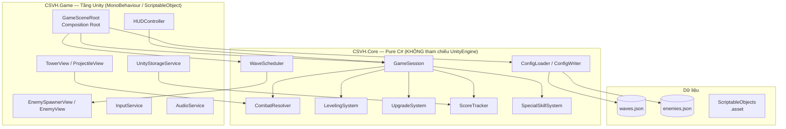
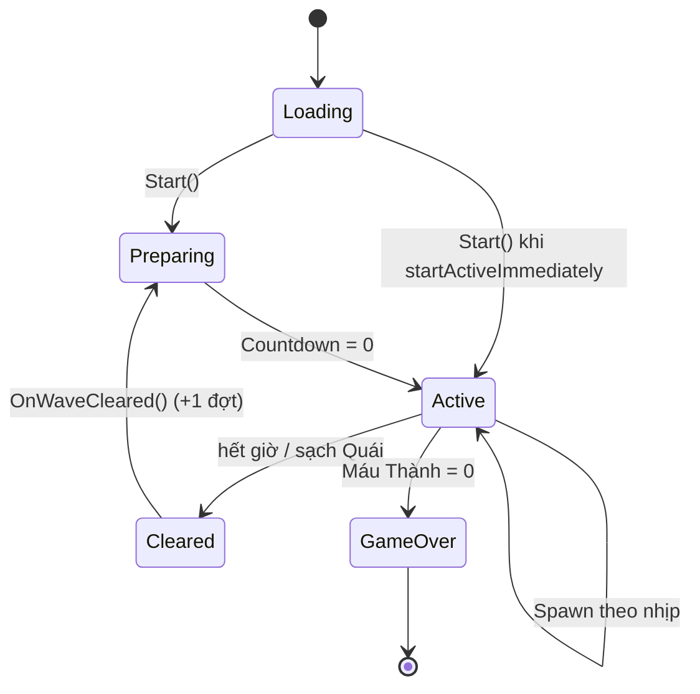

# Cổ Sử Việt Hùng (CSVH) — Tower Defense Việt Nam

Game thủ thành (Tower Defense) 2D góc nhìn isometric/2.5D, lấy chủ đề **truyền thuyết & lịch sử Việt Nam**. Người chơi điều khiển một **Thành** cố định ở góc Đông Nam, ngắm bắn và nâng cấp để chống lại các đợt **Quái** (Hồ Tinh, Quân Tống, Quân Nguyên Mông, Thuồng Luồng, Quỷ Một Giò…) tràn vào từ phía Tây/Tây Bắc. Số đợt là **vô hạn** — chơi để lập **Kỷ Lục** điểm cao nhất.

> [!NOTE]
> Tài liệu này dành cho coder/AI tiếp nhận dự án. Nó mô tả tính năng, kiến trúc, logic cốt lõi, công thức và cách chạy. Đọc kèm các tài liệu trong `.kiro/specs/tower-defense-vn/` (`requirements.md`, `design.md`, `tasks.md`) để hiểu sâu các quyết định thiết kế.

---

## 1. Tech stack

| Hạng mục | Giá trị |
|---|---|
| Engine | **Unity 6** — `6000.4.8f1` |
| Render | **Universal Render Pipeline (URP) 2D** |
| Ngôn ngữ | C# (.NET, hỗ trợ `record`, `init`) |
| JSON | `com.unity.nuget.newtonsoft-json` (Newtonsoft) |
| Input | Unity **Input System** (`com.unity.inputsystem`) |
| UI | UI Toolkit (`UIDocument`) + uGUI dựng động trong code |
| 2D Tooling | Tilemap, Sprite, Aseprite, SpriteShape, PSD Importer |
| Test | Unity Test Framework (NUnit) + **FsCheck** (Property-Based Testing) |
| Source control | Plastic SCM (`com.unity.collab-proxy`) — thư mục `.plastic/` |

Các dependency đầy đủ xem [manifest.json](file:///d:/Unity/csvh/Packages/manifest.json).

---

## 2. Triết lý kiến trúc

Dự án tách **rất rõ** hai tầng để logic game có thể test nhanh, độc lập với Unity Editor:



- **`CSVH.Core` (pure C#)**: toàn bộ luật chơi — nạp/xuất cấu hình JSON, công thức sát thương, EXP/Cấp, hàng đợi spawn, scoring, số học nâng cấp, cooldown skill. **Không** `using UnityEngine`, **không** đọc `Time.deltaTime` trực tiếp (caller bơm `dt` vào). Đây là mục tiêu chính của Property-Based Testing.
- **`CSVH.Game` (Unity)**: MonoBehaviour, ScriptableObject, Prefab, rendering URP, HUD, input, audio. Tầng này chỉ giữ trạng thái runtime của scene và "nối dây" các hệ Core với view.

Lợi ích: PBT chạy trên .NET console (không cần mở Editor) → nhanh; logic ổn định, không vướng `MonoBehaviour` lifecycle.

---

## 3. Cấu trúc thư mục

```
csvh/
├── Assets/
│   ├── CSVH/
│   │   ├── Core/                    # asmdef CSVH.Core (pure C#)
│   │   │   ├── Combat/              # CombatResolver, ProjectileLogic, DamageInputs, ProjectileWorld
│   │   │   ├── Common/              # FieldGeometry, FieldPoint, Result<T,E>
│   │   │   ├── Config/              # EnemyConfig, WaveConfig, SpawnEntry, ConfigLoader/Writer, ConfigError
│   │   │   ├── Culture/             # CulturalCatalog
│   │   │   ├── Game/                # GameSession (bó tất cả hệ Core)
│   │   │   ├── Hud/                 # Format, Localizer, VietnameseBundle, Ui*Keys
│   │   │   ├── Logging/             # ILogSink
│   │   │   ├── Progression/         # LevelingSystem, UpgradeSystem, ScoreTracker,
│   │   │   │                        #   SpecialSkillSystem/State/Params, IRandom, SystemRandom
│   │   │   ├── Storage/             # IStorageService, StorageKeys, VolumeChannel
│   │   │   └── Wave/                # WaveScheduler, SpawnQueue, SpawnIntent, EnemyPath, WaveState
│   │   ├── Game/                    # asmdef CSVH.Game (Unity)
│   │   │   ├── Data/                # *.asset (ScriptableObject instances)
│   │   │   ├── Prefabs/
│   │   │   ├── Sprites/
│   │   │   ├── UI/
│   │   │   └── Scripts/
│   │   │       ├── Bootstrap/       # GameSceneRoot.cs  ← điểm khởi động chính
│   │   │       ├── Spawning/        # EnemySpawnerView, EnemyView, EnemyHealthBarView
│   │   │       ├── Tower/           # TowerView, ProjectileView, TowerHealthBarView, IProjectileTarget
│   │   │       ├── UI/              # HUDController, HudSnapshot, UpgradeIconView, HealthBarBuilder
│   │   │       ├── Input/           # InputService
│   │   │       ├── Audio/           # AudioService
│   │   │       ├── Storage/         # UnityStorageService
│   │   │       ├── Logging/         # UnityLogSink
│   │   │       └── Data/            # UpgradeTableSO, CulturalCatalogSO, SpecialSkillTableSO, EnemySpriteRegistrySO
│   │   └── Tests/                   # CSVH.Tests.Edit (EditMode) + CSVH.Tests.Play (PlayMode)
│   ├── StreamingAssets/             # waves.json, enemies.json  ← cấu hình runtime
│   └── Scenes/SampleScene.unity     # scene chính
├── .kiro/specs/tower-defense-vn/    # requirements.md, design.md, tasks.md
├── Packages/manifest.json
├── PROMPT_IMAGE.md                  # hướng dẫn sinh sprite bằng AI (palette Đông Sơn)
└── README.md
```

> [!IMPORTANT]
> Thư mục `Library/`, `Logs/`, `.vs/`, `obj/` là sản phẩm build/tạm — KHÔNG commit (Unity sẽ tự sinh lại). Các file `.csproj`/`.slnx` ở gốc cũng do Unity tự tạo.

---

## 4. Tính năng (Features)

- **Thành cố định + ngắm thủ công**: Thành đặt cố định góc Đông Nam. Người chơi xoay nòng bằng phím Trái/Phải; Thành **tự bắn liên tục** theo nhịp Tốc_Độ_Bắn dọc hướng ngắm. Có đường ngắm (LineRenderer) kéo tới biên sân.
- **Đợt vô hạn + tăng độ khó**: số đợt không giới hạn. Số Quái mỗi đợt = `5 + (đợt − 1)`. Cứ mỗi 5 đợt mở khóa thêm 1 **Loại Quái** mới (`ceil(đợt / 5)` loại). Mỗi 5 đợt là **đợt boss**.
- **6 Loại Quái** lấy từ truyền thuyết Việt Nam, độ khó tăng dần (xem §7).
- **3 nhánh nâng cấp**: Công (Attack), Giáp (Armor — đồng thời tăng Máu Tối Đa), Đặc Biệt (Special).
- **3 Skill Đặc Biệt** kích hoạt trong trận: Trống Đồng Đông Sơn, Mũi Tên An Dương Vương, Lưỡi Gươm Lê Lợi — mỗi skill có mở khóa, nâng cấp, cooldown riêng.
- **Hệ Cấp/EXP**: tiêu diệt Quái nhận EXP → lên Cấp Thành (`RequiredExp` scale theo hệ số).
- **Kinh tế Vàng**: Quái rớt Vàng để mua nâng cấp.
- **Điểm & Kỷ Lục**: Điểm Phiên tích lũy; Kỷ Lục lưu bền vững và chỉ ghi khi phá kỷ lục.
- **Cấu hình ngoài build**: `waves.json` + `enemies.json` trong `StreamingAssets/` — chỉnh không cần build lại. Nạp lỗi → màn "Cấu hình lỗi" kèm vị trí line/col.
- **HUD tiếng Việt** + màn "Bạn đã thua cuộc" (hiện Điểm Phiên, Kỷ Lục, nút Chơi lại).
- **Tạm dừng khi mở modal**: mở bảng nâng cấp/skill → `Time.timeScale = 0`.
- **Âm lượng lưu trong PlayerPrefs**; Kỷ Lục lưu file JSON (có fallback khi hỏng).

---

## 5. Điều khiển (Controls)

| Phím | Hành động |
|---|---|
| `←` / `→` (hoặc `A` / `D`) | Xoay nòng ngắm Thành (Thành tự bắn) |
| `1` (action "Previous") | Mua nâng cấp **Giáp** |
| `2` (action "Next") | Mua nâng cấp **Công** |
| `Z` | Kích hoạt skill **Trống Đồng** |
| `X` | Kích hoạt skill **Mũi Tên** |
| `C` | Kích hoạt skill **Lưỡi Gươm** |
| Nhấp icon HUD | Mở bảng nâng cấp Công/Giáp/Special/Cấp, hoặc kích hoạt skill |

Skill kích hoạt đọc trực tiếp `Keyboard.current` (độc lập action map). Mua Giáp/Công đi qua `InputActionAsset` (đổi tên action trong Inspector của [InputService](file:///d:/Unity/csvh/Assets/CSVH/Game/Scripts/Input/InputService.cs)).

---

## 6. Luồng khởi động & vòng lặp game

Điểm vào duy nhất là [GameSceneRoot](file:///d:/Unity/csvh/Assets/CSVH/Game/Scripts/Bootstrap/GameSceneRoot.cs) (gắn trên 1 GameObject trong SampleScene). Nó là **composition root**:

1. `Start()` — nạp `waves.json` + `enemies.json` từ `StreamingAssets` qua [ConfigLoader](file:///d:/Unity/csvh/Assets/CSVH/Core/Config/ConfigLoader.cs). Lỗi → `ShowConfigError` và dừng.
2. Dựng [FieldGeometry](file:///d:/Unity/csvh/Assets/CSVH/Core/Common/FieldGeometry.cs) (Thành ở góc Đông Nam, kích thước sân).
3. Tạo các hệ Core: [WaveScheduler](file:///d:/Unity/csvh/Assets/CSVH/Core/Wave/WaveScheduler.cs), [LevelingSystem](file:///d:/Unity/csvh/Assets/CSVH/Core/Progression/LevelingSystem.cs), [UpgradeSystem](file:///d:/Unity/csvh/Assets/CSVH/Core/Progression/UpgradeSystem.cs), [ScoreTracker](file:///d:/Unity/csvh/Assets/CSVH/Core/Progression/ScoreTracker.cs), [SpecialSkillSystem](file:///d:/Unity/csvh/Assets/CSVH/Core/Progression/SpecialSkillSystem.cs) — bó tất cả vào một [GameSession](file:///d:/Unity/csvh/Assets/CSVH/Core/Game/GameSession.cs).
4. `WireViews` / `WireHudInputBridge` — nối các view MonoBehaviour với hệ Core qua callback/event.
5. `Update()` mỗi frame:
   - `session.Tick(dt)` → hồi cooldown skill.
   - `scheduler.Tick(dt, aliveCount, spawnCap)` → trả `SpawnIntent[]` cho `EnemySpawnerView` hiện thực hóa prefab.
   - Phát hiện đợt Cleared → `OnWaveCleared()` (tăng đợt). Phát hiện GameOver → chốt điểm + hiện màn thua.
   - `PushHudSnapshot()` → đẩy một [HudSnapshot](file:///d:/Unity/csvh/Assets/CSVH/Game/Scripts/UI/HudSnapshot.cs) bất biến cho HUD.

### Vòng đời một Đợt (State machine của WaveScheduler)



Hai chế độ kết thúc đợt (cấu hình trong GameSceneRoot):
- **Time-based** (mặc định `waveDurationSeconds = 60s`): đợt hết giờ → sang đợt kế; Quái chưa kịp spawn được **carry-over** sang đợt sau. Dọn sạch sớm → chờ `earlyClearGraceSeconds` (5s) rồi skip.
- **Sạch-Quái** (`waveDurationSeconds = 0`): đợt kết thúc khi mọi Quái đã spawn và bị diệt hết.

`startWaveImmediately = true` → bỏ Pha Chuẩn Bị, các đợt nối thẳng nhau.

---

## 7. Quái (Enemies)

Cấu hình trong [enemies.json](file:///d:/Unity/csvh/Assets/StreamingAssets/enemies.json). Thứ tự mở khóa theo độ khó (mỗi 5 đợt thêm 1 loại):

| # | Id | Tên | Máu | Tốc độ | ST cận chiến | Kháng | Vàng | EXP | Điểm |
|---|---|---|---|---|---|---|---|---|---|
| 1 | `Hồ_Tinh` | Hồ Tinh | 15 | 2.4 | 5 | 0 | 5 | 8 | 10 |
| 2 | `Quân_Tống` | Quân Tống | 35 | 1.4 | 8 | 1 | 8 | 10 | 15 |
| 3 | `Quân_Nguyên_Mông` | Quân Nguyên Mông | 50 | 1.9 | 10 | 2 | 12 | 14 | 20 |
| 4 | `Mộc_Tinh` | Mộc Tinh | 70 | 0.9 | 6 | 3 | 10 | 12 | 18 |
| 5 | `Thuồng_Luồng` | Thuồng Luồng | 110 | 0.8 | 18 | 4 | 18 | 22 | 30 |
| 6 | `Quỷ_Một_Giò` | Quỷ Một Giò (BOSS) | 700 | 1.0 | 95 | 8 | 80 | 120 | 200 |

> [!NOTE]
> `Id` giữ nguyên **có dấu tiếng Việt** trong JSON và code. Riêng tên file sprite dùng ASCII không dấu (xem [PROMPT_IMAGE.md](file:///d:/Unity/csvh/PROMPT_IMAGE.md) — hướng dẫn sinh sprite + palette Đông Sơn).

---

## 8. Logic cốt lõi & công thức

Tất cả công thức nằm trong tầng Core (pure, dễ test). Các bất biến (invariants) được xác minh bằng 25 Correctness Properties trong [design.md](file:///d:/Unity/csvh/.kiro/specs/tower-defense-vn/design.md).

### Sát thương — [CombatResolver](file:///d:/Unity/csvh/Assets/CSVH/Core/Combat/CombatResolver.cs)
- **Đạn → Quái**: `max(0, BaseDamage × AttackMultiplier − Resistance)`
- **Quái → Thành**: `max(0, MeleeDamage − Armor)` (làm tròn lên khi trừ máu)
- **Kẹp máu**: `CurrentHp ∈ [0, MaxHp]` sau mỗi cập nhật. Chạm 0 → `WaveScheduler.OnGameOver()`.

### Nâng cấp — [UpgradeSystem](file:///d:/Unity/csvh/Assets/CSVH/Core/Progression/UpgradeSystem.cs) + [UpgradeTableSO](file:///d:/Unity/csvh/Assets/CSVH/Game/Scripts/Data/UpgradeTableSO.cs)
- **Giáp hiện tại**: `BaseArmor + ArmorLevel × ArmorStep` (mặc định step = 5; cũng cộng vào Máu Tối Đa).
- **Hệ số Công**: `1 + AttackLevel × AttackStep` (mặc định step = 0.1).
- **Giá nâng cấp**: `max(1, round((BaseCost + trackOffset) × CostGrowth^level))` với `trackOffset`: Giáp 0, Công 5, Special 50 (Special đắt nhất). Mặc định `BaseCost = 50`, `CostGrowth = 1.25`.
- Thiếu Vàng → `NotEnoughGold`, **không đổi trạng thái**, HUD hiện toast "Không đủ Vàng".

### Cấp/EXP — [LevelingSystem](file:///d:/Unity/csvh/Assets/CSVH/Core/Progression/LevelingSystem.cs)
- `while (CurrentExp ≥ RequiredExp) { CurrentExp −= RequiredExp; Level++; RequiredExp = ⌈RequiredExp × scale⌉ }`
- Mặc định `baseRequiredExp = 100`, `scale = 1.5`. Bất biến: `Level` không giảm, `0 ≤ CurrentExp < RequiredExp`.

### Điểm — [ScoreTracker](file:///d:/Unity/csvh/Assets/CSVH/Core/Progression/ScoreTracker.cs)
- `SessionScore += reward` (mỗi Quái diệt) `+ waveBonusBase × waveNumber` (hoàn thành đợt). Đơn điệu không giảm.
- `TryFinalize` → `HighScore = max(HighScore, SessionScore)`, chỉ ghi storage khi vượt kỷ lục.

### Skill Đặc Biệt — [SpecialSkillState](file:///d:/Unity/csvh/Assets/CSVH/Core/Progression/SpecialSkillState.cs)
- `CurrentDamage = Base + (Level−1) × DamageStep`
- `CurrentCooldownMax = max(MinCooldown, Base − (Level−1) × CooldownStep)`
- Khóa lúc đầu → mua bằng Vàng (`UnlockCost`) mới dùng. Đang hồi chiêu → `TryActivate` trả `NotReady`.
- **Trống Đồng / Lưỡi Gươm**: "%" cấp quyết định số lần nổ/chém thêm. **Mũi Tên**: 1 phát, "%" quyết định choáng.

### Hình học sân — [FieldPoint](file:///d:/Unity/csvh/Assets/CSVH/Core/Common/FieldPoint.cs)
- Cổng spawn hợp lệ: `X ≤ 0 ∨ Y ≥ 0` (Tây/Tây Bắc). Vị trí Thành hợp lệ: `X > 0 ∧ Y < 0` (Đông Nam).

---

## 9. Cấu hình dữ liệu

### `waves.json` ([file](file:///d:/Unity/csvh/Assets/StreamingAssets/waves.json))
Mảng các đợt. Mỗi đợt có `waveNumber`, `preparationSeconds`, `spawnGates[]` (`{x, y}`), `spawns[]` (`{enemyId, count, spawnIntervalSeconds}`).

```json
{
  "waveNumber": 1,
  "preparationSeconds": 15.0,
  "spawnGates": [ { "x": -8.0, "y": 4.5 }, { "x": 0.0, "y": 6.0 } ],
  "spawns": [ { "enemyId": "Hồ_Tinh", "count": 5, "spawnIntervalSeconds": 1.8 } ]
}
```

> [!TIP]
> File JSON định nghĩa 5 đợt; vì số đợt vô hạn, `WaveScheduler` tái sử dụng cấu hình theo chu kỳ `(đợt − 1) % waves.Count` cho đợt vượt quá. Đội hình thực tế ở runtime do `GameSceneRoot.BuildWaveSpawns` quyết định (mở khóa loại Quái dần + scale tổng số Quái).

### ScriptableObjects ([Game/Data](file:///d:/Unity/csvh/Assets/CSVH/Game/Data))
- `UpgradeTable.asset` — bảng giá & bước tăng nâng cấp ([UpgradeTableSO](file:///d:/Unity/csvh/Assets/CSVH/Game/Scripts/Data/UpgradeTableSO.cs)).
- `SpecialSkillTable.asset` — tham số 3 skill ([SpecialSkillTableSO](file:///d:/Unity/csvh/Assets/CSVH/Game/Scripts/Data/SpecialSkillTableSO.cs)).
- `CulturalCatalog.asset` — danh mục tên văn hóa ([CulturalCatalogSO](file:///d:/Unity/csvh/Assets/CSVH/Game/Scripts/Data/CulturalCatalogSO.cs)).
- `EnemySpriteRegistry.asset` — map Id Quái → sprite ([EnemySpriteRegistrySO](file:///d:/Unity/csvh/Assets/CSVH/Game/Scripts/Data/EnemySpriteRegistrySO.cs)).

### Lưu trữ bền vững
| Khóa | Loại | Vị trí |
|---|---|---|
| `csvh.volume.music` / `csvh.volume.sfx` | float [0,1] | PlayerPrefs |
| `highscore.json` | `{ "highScore": <long> }` | `Application.persistentDataPath` (fallback `0` nếu hỏng) |

---

## 10. Cách chạy

1. Cài **Unity 6 (6000.4.8f1)** qua Unity Hub (kèm module phù hợp nền tảng build).
2. Mở Hub → **Add** → trỏ tới thư mục `d:\Unity\csvh`. Unity sẽ tự khôi phục `Library/` và packages (cần mạng cho package Git `unity-mcp`).
3. Mở scene [SampleScene.unity](file:///d:/Unity/csvh/Assets/Scenes/SampleScene.unity).
4. Bấm **Play**. Đảm bảo GameObject gắn `GameSceneRoot` đã gán đủ tham chiếu (HUD, Input, Audio, Tower, Spawner, các SO Data).

> [!WARNING]
> Nếu vào Play mà thấy màn "Cấu hình lỗi": kiểm tra `Assets/StreamingAssets/waves.json` và `enemies.json` tồn tại và đúng cú pháp JSON. Thông báo lỗi sẽ kèm `FieldPath` + line/col.

---

## 11. Testing

Test chia 3 tầng (xem [design.md](file:///d:/Unity/csvh/.kiro/specs/tower-defense-vn/design.md) §Testing Strategy):

| Tầng | Khung | Vị trí |
|---|---|---|
| Property-Based (P1–P25) | FsCheck + NUnit | `Assets/CSVH/Tests/EditMode/` |
| Unit (example) | NUnit | `Assets/CSVH/Tests/EditMode/` |
| Integration / smoke | Unity Test Framework PlayMode | `Assets/CSVH/Tests/PlayMode/` |

Chạy: Unity menu **Window → General → Test Runner** → tab EditMode/PlayMode → **Run All**. EditMode chạy nhanh không cần scene (logic Core thuần). FsCheck DLL nằm trong `Assets/CSVH/Tests/Plugins/`.

---

## 12. Quy ước cho người tiếp nhận / AI

- **Đừng để Core phụ thuộc Unity**: mọi file trong `Assets/CSVH/Core/` không được `using UnityEngine`. Thời gian luôn được caller bơm vào qua `Tick(dt)`.
- **Lỗi đường-dẫn-bình-thường dùng `Result<T,E>` / enum**, không `throw`. `throw` chỉ cho lỗi lập trình (tham số sai ở constructor).
- **Mọi log đi qua [ILogSink](file:///d:/Unity/csvh/Assets/CSVH/Core/Logging/ILogSink.cs)** để test quan sát được.
- **HUD chỉ cập nhật qua `HudSnapshot` bất biến** mỗi frame, không sửa state trực tiếp.
- **`Id` Quái giữ dấu tiếng Việt**; tên file sprite chuyển ASCII snake_case (xem PROMPT_IMAGE.md).
- Các comment dạng `// Feature: tower-defense-vn, Requirement X.Y / Property N` liên kết code ↔ spec trong `.kiro/specs/`. Giữ nguyên khi sửa code.
- Tài liệu tham chiếu sâu: [requirements.md](file:///d:/Unity/csvh/.kiro/specs/tower-defense-vn/requirements.md), [design.md](file:///d:/Unity/csvh/.kiro/specs/tower-defense-vn/design.md), [tasks.md](file:///d:/Unity/csvh/.kiro/specs/tower-defense-vn/tasks.md).
